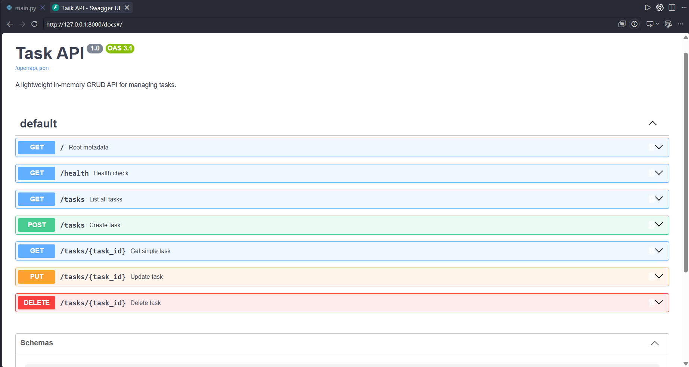

# Task API

A simple SQLite-backed CRUD API for managing tasks, built with FastAPI.

## Setup

```bash
pip install fastapi uvicorn
```

## Run

```bash
uvicorn main:app --reload
```

The API will be available at `http://127.0.0.1:8000`.

## Week 3: SQLite Database

The API stores tasks in a local SQLite database named `tasks.db`. The database and `tasks` table are created automatically when the application starts. If the table is empty, the API seeds it with three example tasks.

Tasks persist across application restarts. To reset the sample data, stop the API, delete `tasks.db`, and start the API again.

## Screenshot of the SQLite and query


## Week 3 : Containerized Stack

Run the full stack (FastAPI + PostgreSQL) with a single command:
```cp .env.example .env
docker compose up --build
```
- The API runs at http://localhost:8000.

- Stop the containers with docker compose down.

- Tasks persist across restarts via the Docker volume taskdata.

## Environment Variables
DATABASE_URL: postgresql://postgres:dev@db:5432/tasks (stored in .env, git-ignored).

## PostgreSQL Verification


## Documentation

- Swagger UI: `http://127.0.0.1:8000/docs`
- ReDoc: `http://127.0.0.1:8000/redoc`

## Endpoints

- `GET /` - API metadata
- `GET /health` - Health check
- `GET /tasks` - List all tasks
- `GET /tasks/{task_id}` - Get one task
- `POST /tasks` - Create a task
- `PUT /tasks/{task_id}` - Update a task
- `DELETE /tasks/{task_id}` - Delete a task

## Screenshot of the UI 

Example request:

```bash
curl -X POST "http://127.0.0.1:8000/tasks" \
  -H "Content-Type: application/json" \
  -d "{\"title\": \"Learn FastAPI\"}"
```

> The local `tasks.db` file is ignored by Git.
